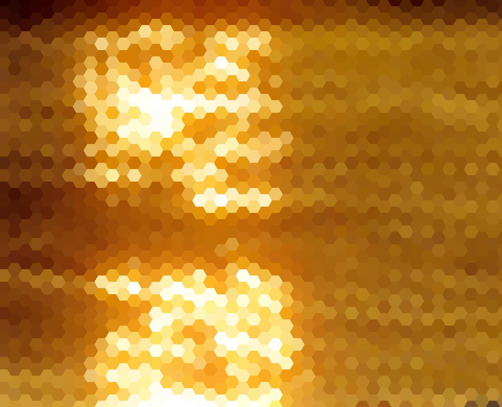

Using this repository you can pixelize your images into hexagon grid!

### Samples
Normal image

Pixelized with Radius = 5

Pixelized with Radius = 15

Pixelized with Radius = 30


### Requirements
Python 3+

You will need Numpy, Pillow, Shapely, and Tqdm to run this code.
You can install the requirements easily using 
```bash
pip install -r requirements.txt
```

### How to run
```bash
python main.py your_image.jpg output_image.jpg Radius
```
For example to generate the samples you can run
```bash
python3 main.py samples/sample.jpg samples/pixelized_5.jpg 5
```

Thanks to Stephan Hügel for hexgrid.py code.
