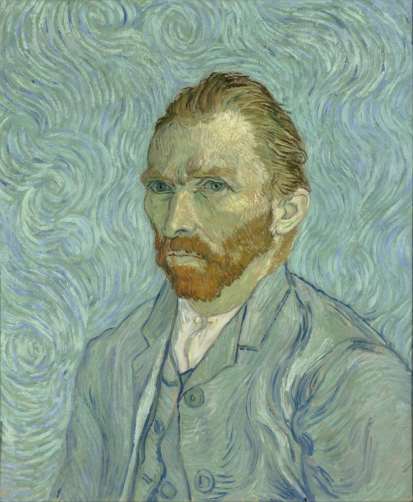
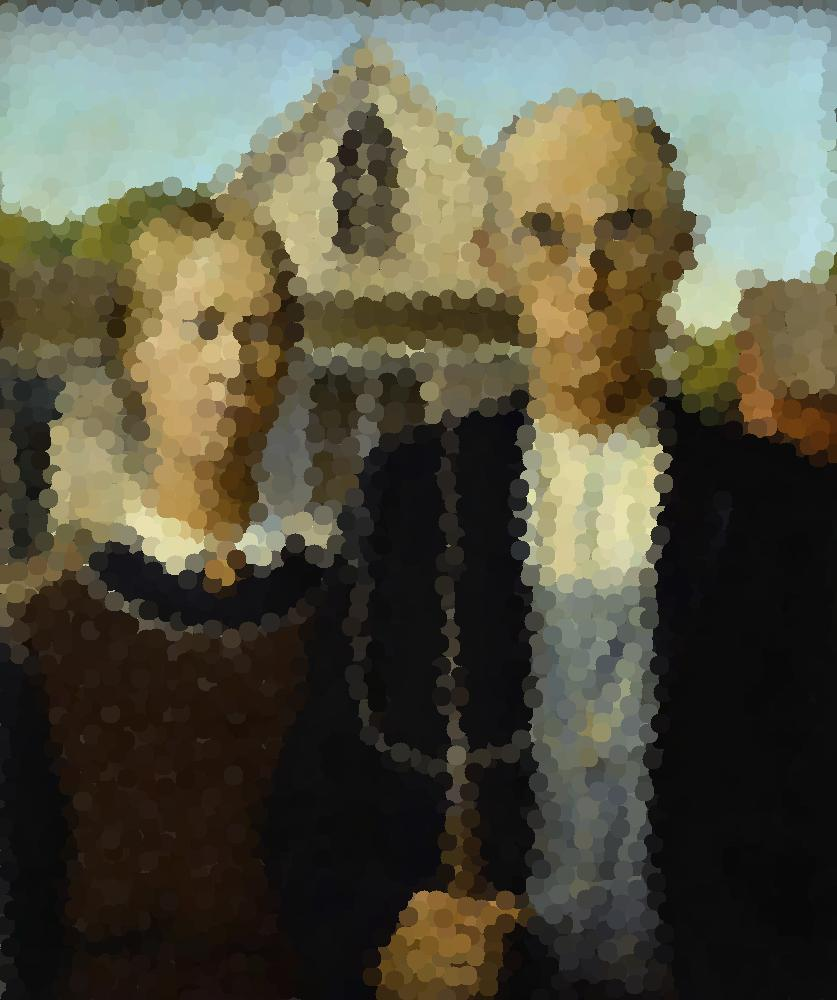

Using this repository you can pixelize your images into hexagon grid!

### Samples
Normal image

Hexagonal             | Square          |       Splited      
:-------------------------:|:-------------------------:|:-------------------------:
 |   |   
 |   |  
 |   |   | 
 |   |   | 

Pyramid                   |         Cubical         |   Double Cubical
:-------------------------:|:-------------------------:|:-------------------------:
  |  | 
  |  | 
  |  | 
  |  | 
 
 
Blob                    |   Voronoi    |
:-------------------------:|:-------------------------:|
 | 
 |  
 |  
 | 

### Requirements
Python 3+

You will need Numpy, Pillow, Shapely, and Tqdm to run this code.
You can install the requirements easily using 
```bash
pip install -r requirements.txt
```

### How to run
```bash
python main.py your_image.jpg output_image.jpg mode Radius
```
For example to generate the samples you can run
```bash
python3 main.py samples/sample.jpg samples/pixelized_5.jpg hex 5
```

Thanks to Stephan Hügel for hexgrid.py code.
